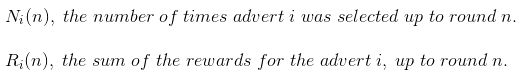
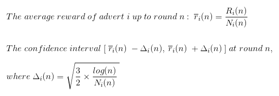
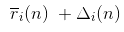
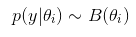
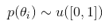
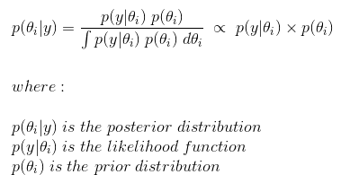
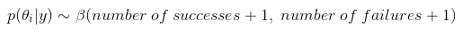

# Marketing Adverts Optimisation

**Task: Which advert should the company use?**

We currently work in the analytics department of a car company. The marketing team has produced 10 great adverts for a new SUV but are unsure which advert to choose as their final advert to release. We wish to investigate which advert customers will respond to the best and optimise our best advert.

We will be using "Reinforcement Learning" to complete this marketing business task, with our two approaches being the "Upper Confidence Bound" and "Thompson Sampling" algorithm.

## Reinforcement Learning

Reinforcement learning is a branch of machine learning and is also referred to as "Online Learning" or "Interactive Learning". It is used to solve interacting problems where the data observed up to time T is considered to decide which action to take at time T+1. An application in artificial intelligence involves training machines such as walking robot dogs to perform tasks. In essence the desired outcome provides the AI machine with a reward (1), or an undesired outcome with punishment (0). Machines use this approach which enables them to learn through trial and error, a dynamic strategy.

## Upper Confidence Bound

In our task there are two main factors to consider, they are "Exploration" and "Exploitation". During exploration, our goal is to figure out which advert is the best. However, exploitation refers to maximising our results from our findings by maximising the usage of the best performing advert.

In theory, we may approach this task by releasing each advert the same number of times and at the end of the experiment, the best advert will be the advert that received the most clicks. However a disadvantage of this is regret, a mathematical concept from decision theory.

**Regret**

Regret is the consequence or amount suffered when we do not use the optimal method. Therefore, the difference between our optimal result and sub optimal result is deemed our regret. However, if we do not explore long enough we may except the sub-optimal advert as our optimal advert.

We wish to combine exploration and exploitation together, and get to the optimal solution as soon as we can to maximise the output of our efforts.

In the dataset under study, we have 10 columns that represent our 10 adverts, and 10,000 rows which represent 10,000 rounds. The dataset contains 0's and 1's which represent whether a customer would have selected that advert (1) or not (0), if that advert was shown to that person. Each person is represented by a round n (1 of 10,000).

**Steps for applying the Upper Confidence Bound algorithm**

- **Step 1:** At each round n, we consider two numbers for each ad i:

  

- **Step 2:** From these two numbers we compute:

  

- **Step 3:** We select the ad i that has the maximum upper confidence bound:
  
  

The first few runs in the code will be trial runs (at least one run per advert). Initially, our observed value will fall within our confidence boundary/band due to our high level of confidence; we choose 1e400 in our code.

In the long run, by the "Law of Large Numbers" the observed average will converge to the expected average. The main idea is that we keep using (exploiting) the advert with the highest upper confidence bound.

In the python file attached, we will compare the results of the total_reward between the random model and the UCB model. In summary, if we were to randomly assign an advert for the viewer, we observe the total_reward being approximately between 1,200 and 1,300. However, if we use the UCB model we observe the total_reward to be 2,178. Therefore the UCB algortihm has increased the total_reward by approximately 1,000. This means 1,000 more viewers clicked the advert for the SUV, resulting in a higher number of possible sales.

## Thompson Sampling

Thompson sampling is a reinforcement learning algorithm where the probabilistic distributions have been created from the values we have obtained from our data under study. The algorithm is not attempting to guess the distribution behind the adverts, but is constructing the distributions of where we think the actual expected value may lie. The optimal advert will be utilised more and over time, the model will converge to the real expected value and a narrow confidence interval.

**Note**

The UCB algorithm is deterministic, therefore there is no randomness in the algorithm itself. However, the UCB requires an update at every round. The Thompson Sampling algorithm is a probabilistic algorithm which accommodates delayed feedback and provides better empirical evidence due to its nature of observation and experience. However, as the distributions represent the perception of the world and where we think the expected returns lie, the algorithm generates random values from these distributions.

**Bayesian Inference**

Ad i will get rewards y from the Bernoulli distribution given below:

Theta_i is unknown but we set its uncertainty by assuming it has a uniform distribution, which is the prior distribution; this is given below:

Bayes rule: We approach Theta_i by the posterior distribution given below:

The beta distribution is given below:

At each round n we take a random draw Theta_i(n) from this posterior distribution p(Theta_i|y), for each advert i. At each round n we select the advert i that has the highest Theta_i(n).

**Steps for applying the Thompson Sampling algorithm**

**Step 1:** At each round n, we consider two numbers for each ad i:

